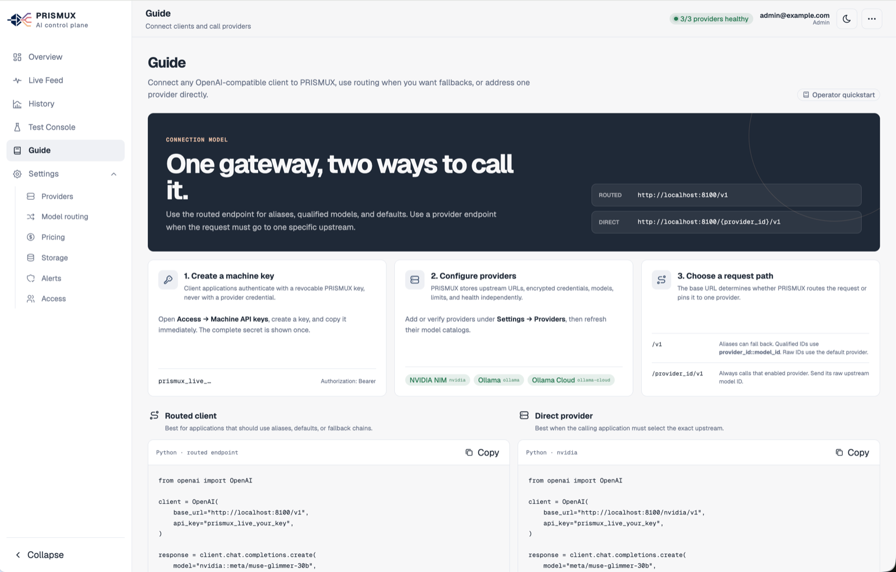
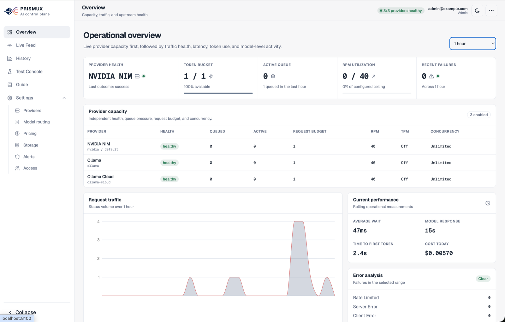
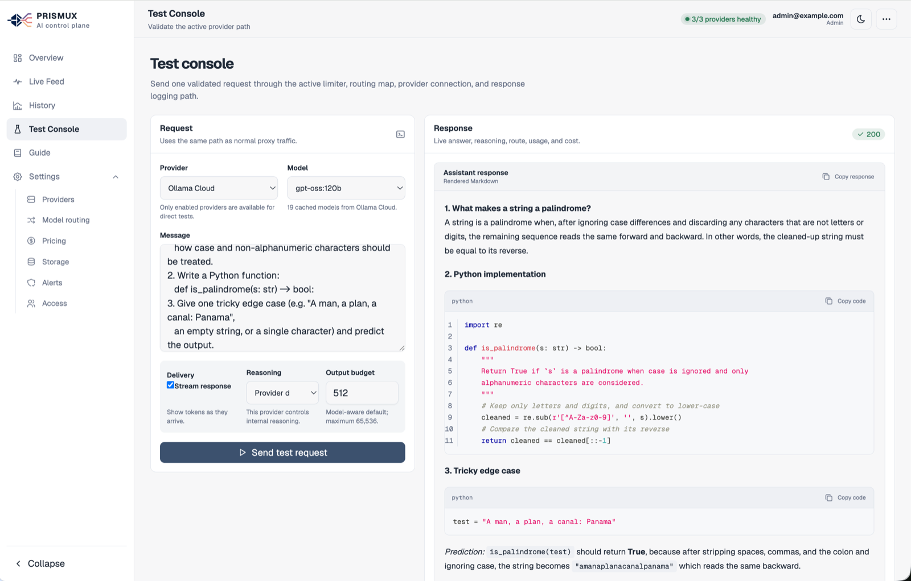
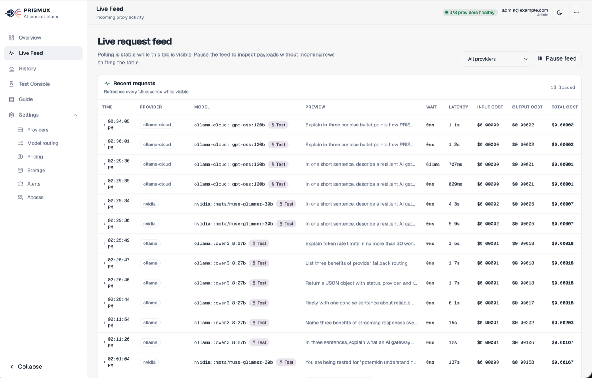
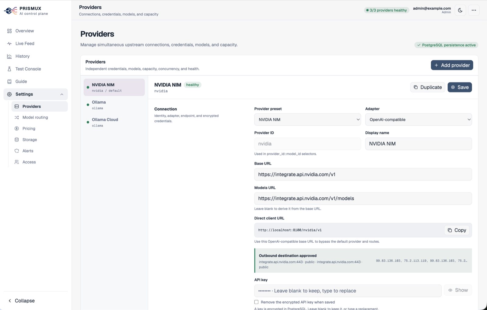
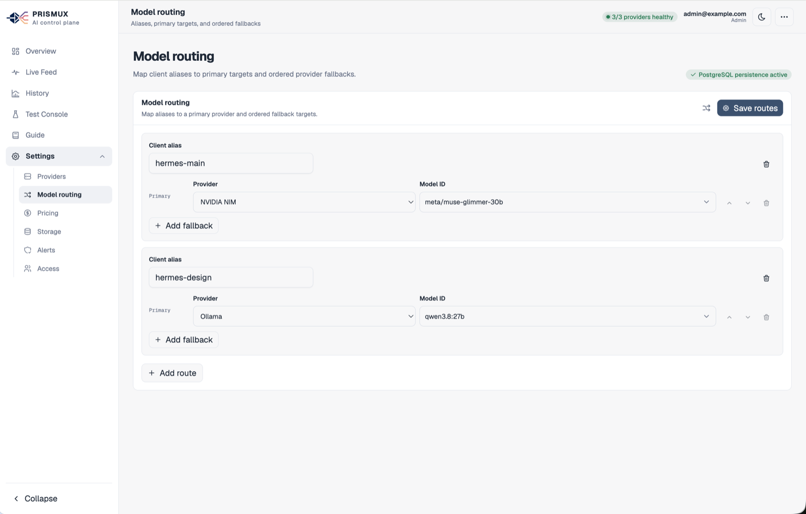
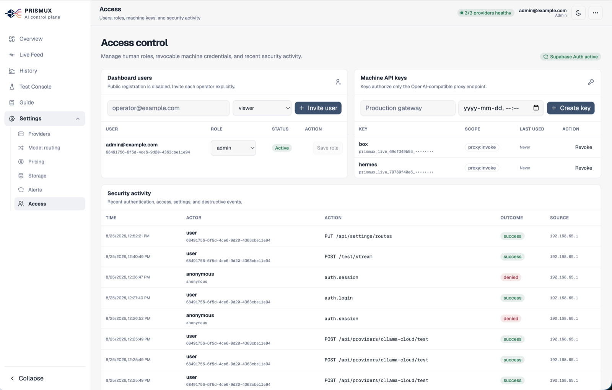

<p align="center">
  <picture>
    <source media="(prefers-color-scheme: dark)" srcset="frontend/public/brand/prismux-dark.png">
    
  </picture>
</p>

<p align="center">
  A self-hosted, multi-provider AI gateway and operational control plane.
</p>

<p align="center">
  <a href="#quickstart">Quickstart</a> ·
  <a href="docs/GUIDE.md">Guide</a> ·
  <a href="docs/PRODUCTION_DEPLOYMENT.md">Production deployment</a> ·
  <a href="CONTRIBUTING.md">Contributing</a> ·
  <a href="CHANGELOG.md">Changelog</a>
</p>

---

PRISMUX puts one OpenAI-compatible API in front of as many upstream providers as you run — OpenAI, Anthropic, NVIDIA NIM, Ollama, OpenRouter, Groq, Together AI, Mistral, xAI, LM Studio, or any OpenAI-compatible host — and gives you the operational layer none of them provide on their own:

- **One API, many providers** — OpenAI-compatible endpoints, provider-specific or routed through aliases
- **Fallback routing** — ordered targets per alias, with automatic failover on transient errors
- **Capacity controls** — RPM, TPM, burst, concurrency, and timeout, independently per provider
- **Streaming** — real SSE streaming with tool calls, reasoning deltas, and usage on both OpenAI- and Anthropic-shaped APIs
- **Cost accounting** — per-model pricing, computed cost on every request, exports, and dashboard totals
- **Operational dashboard** — live feed, history, health, capacity, and cost, all in one React app
- **RBAC and audit** — Viewer/Operator/Admin roles, revocable machine API keys, full audit log
- **SSRF-hardened outbound** — every provider call passes through a centralized policy: DNS pinning, no redirects, permanent cloud-metadata blocking

Backed by PostgreSQL through a self-hosted Supabase stack (Auth, Storage, Studio) — your data and credentials stay on infrastructure you control.

## Quickstart

```sh
cp .env.example .env
docker compose up --build
```

Open `http://localhost:8100`, sign in with the bootstrap admin account from `.env`, and follow the in-app **Guide** page to add a provider and issue your first machine key.

See [docs/GUIDE.md](docs/GUIDE.md) for the full walkthrough, and [docs/PRODUCTION_DEPLOYMENT.md](docs/PRODUCTION_DEPLOYMENT.md) before running this anywhere beyond localhost.

## Screenshots

<p align="center">
  
</p>

<table>
  <tr>
    <td width="33%"><br><sub><b>Overview</b></sub></td>
    <td width="33%"><br><sub><b>Test Console</b></sub></td>
    <td width="33%"><br><sub><b>Live Feed</b></sub></td>
  </tr>
  <tr>
    <td width="33%"><br><sub><b>Providers</b></sub></td>
    <td width="33%"><br><sub><b>Model Routing</b></sub></td>
    <td width="33%"><br><sub><b>Access</b></sub></td>
  </tr>
</table>

More views (History, Pricing, Storage, Alerts) are in [docs/screenshots/](docs/screenshots/).

## Tech stack

- **Backend** — Python, FastAPI, SQLAlchemy (async) + asyncpg, Alembic, PyJWT, `cryptography` (Fernet)
- **Frontend** — Vite, React 19, TypeScript, Tailwind CSS v4, TanStack Query/Table, React Hook Form + Zod, Recharts
- **Infrastructure** — Docker Compose, PostgreSQL, self-hosted Supabase (Auth, Storage, Studio, PostgREST, postgres-meta)

## Contributing

Issues and pull requests are welcome — see [CONTRIBUTING.md](CONTRIBUTING.md) for how to set up a dev environment and what to expect from review.

## Support this project

PRISMUX is an independent, self-hosted project maintained in the open. If it's useful to you, consider sponsoring its development:

<p align="left">
  <a href="https://github.com/sponsors/m3hrdadfi">
    
  </a>
</p>

Sponsorships fund ongoing development, provider-adapter coverage, and production-hardening work (backups, secrets rotation tooling, broader test coverage). Every bit helps, and every sponsor is genuinely appreciated.

## License

[MIT](LICENSE)
